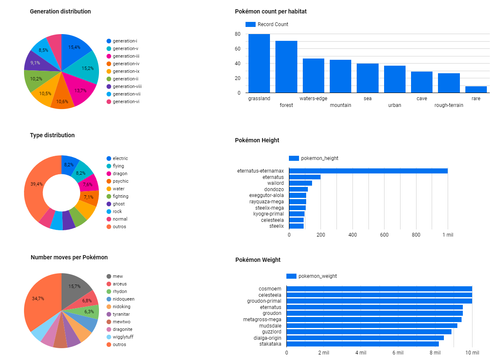
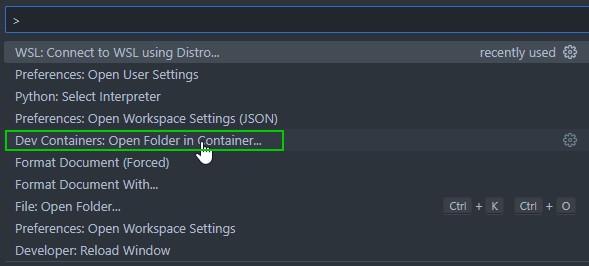

# Overview
This project is focused on analyzing Pokemon data. The goal is to collect data from various sources, store it in a data lake, transform it, and load it into a data warehouse for analysis and visualization.


The data is collected from the [PokeAPI](https://pokeapi.co/) using Python scripts. The data is then stored in a Google Cloud Storage bucket, and transformed using Google Cloud Dataflow. The transformed data is then loaded into Google BigQuery for analysis and visualization.

## What questions am I trying to answer? 
As this project looks at MTG from a meta-perspective we are diving into the following:
1. How many pokémon's exists in each of generations?
2. How many pokémon's exists in each of habitat?
3. What is the type distribution?
4. Number of moves per pokémon?
5. Which pokémon has the highest height?
6. Which pokémon has the highest weight?


## What technologies are being used?
- Cloud: `Google Cloud`
- Infrastructure: `Terraform`
- Orchestration: `Prefect`
- Data lake: `Google Cloud Storage`
- Data transformation: `DBT`
- Data warehouse: `BigQuery`
- Data visualization: `Google Looker Studio`

## Dashboard example
[Click here](https://lookerstudio.google.com/reporting/349d23d5-05df-4146-9d58-dee95bcb0c85/page/r3fMD) to see my Looker dashboard.

<p align="left">


</p>

## How to make it work?
1. Setup your Google Cloud environment
   - Create a [Google Cloud Platform project](https://console.cloud.google.com/cloud-resource-manager)
   - Configure Identity and Access Management (IAM) for the service account, giving it the following privileges: BigQuery Admin, Storage Admin and Storage Object Admin
   - Download the JSON credentials and save it, e.g. to `~/.gc/<credentials>`
   - Open Visual Studio Code and **click Ctrl+Shift+P** to bring you directly to the editor commands and search **Open Folder in Container** and select the project folder. This will load all the necessary dependencies for the correct functioning of the project:

    

   - Let the [environment variable point to your GCP key](https://cloud.google.com/docs/authentication/application-default-credentials#GAC), authenticate it and refresh the session token
    ```bash
    export GOOGLE_APPLICATION_CREDENTIALS=<path_to_your_credentials>.json
    gcloud auth activate-service-account --key-file $GOOGLE_APPLICATION_CREDENTIALS
    gcloud auth application-default login
    ```

2. Setup your infrastructure
   - Assuming you are using Linux AMD64 run the following commands to install Terraform - if you are using a different OS please choose the correct version [here](https://developer.hashicorp.com/terraform/downloads) and exchange the download link and zip file name

   ```bash
   sudo apt-get install unzip
   cd ~/bin
   wget https://releases.hashicorp.com/terraform/1.4.1/terraform_1.4.1_linux_amd64.zip
   unzip terraform_1.4.1_linux_amd64.zip
   rm terraform_1.4.1_linux_amd64.zip
   ```
   - To initiate, plan and apply the infrastructure, adjust and run the following Terraform commands
   ```bash
   cd terraform/
   terraform init
   terraform plan -var="project=<your-gcp-project-id>"
   terraform apply -var="project=<your-gcp-project-id>"
   ```
3. Setup your orchestration
   - If you do not have a prefect workspace, sign-up for the prefect cloud and create a workspace [here](https://app.prefect.cloud/auth/login)
   - Create the [prefect blocks](https://docs.prefect.io/concepts/blocks/) via the cloud UI (GcpCredentials and GcsBucket)
   - Adjust the keyfile location at `dbt/profiles.yml` to the path of your Google Cloud credentials JSON
    ```
    nano ~/.dbt/profiles.yml
    ```
   - To execute the flow, run the following commands in two different CL terminals
   ```bash
   prefect agent start -q 'default'
   ```
   ```bash
   python prefect/flows/pokeapi_to_gcp.py
   ```
   ```bash
   python prefect/flows/upload_to_bq.py
   ```
